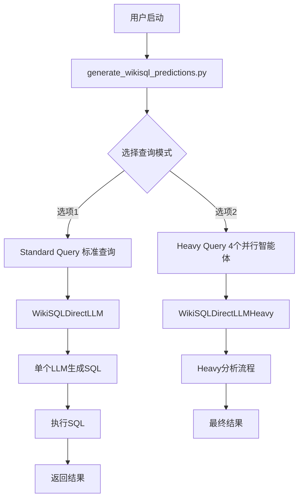
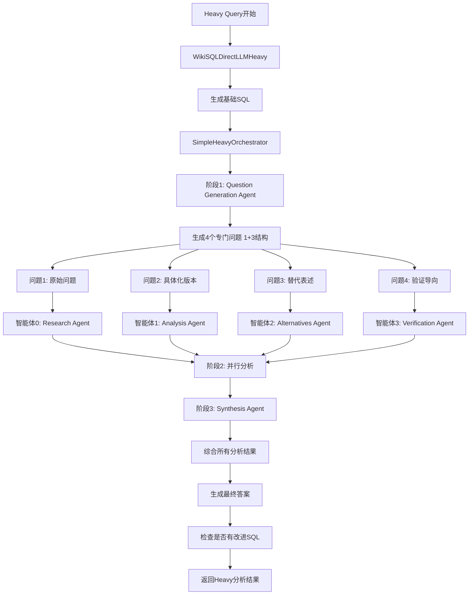
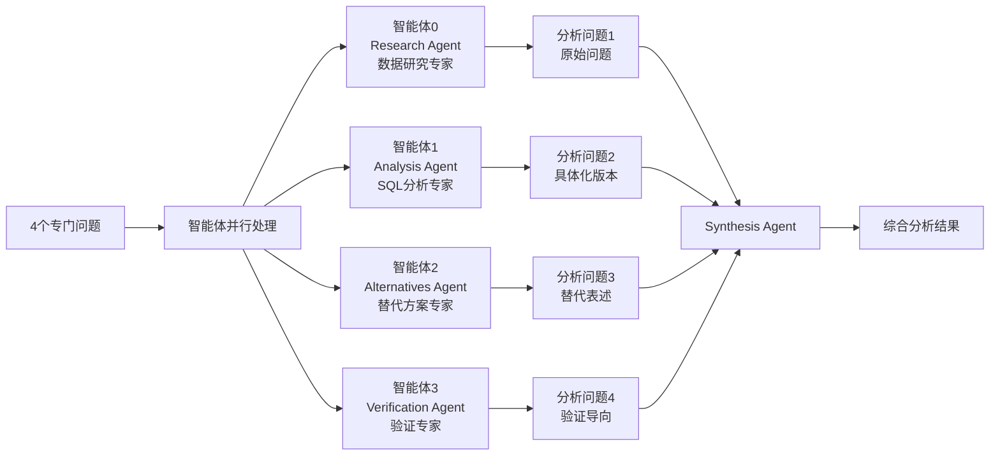
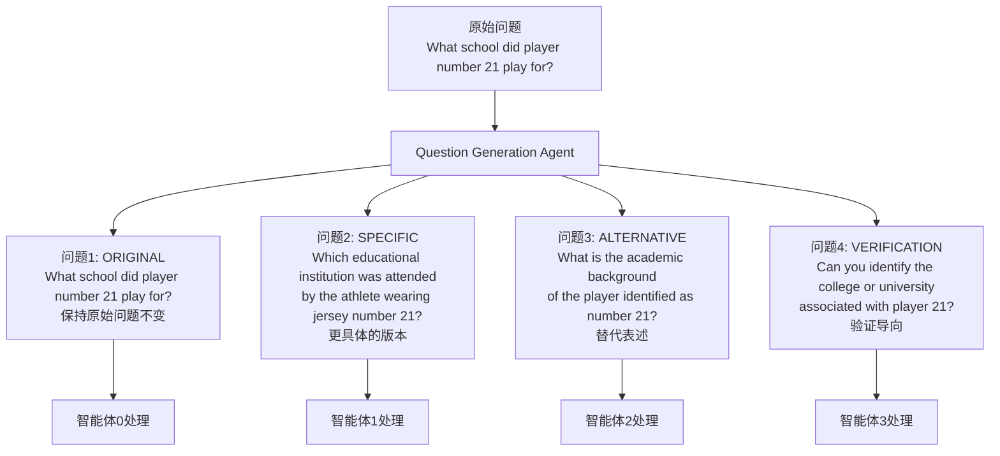
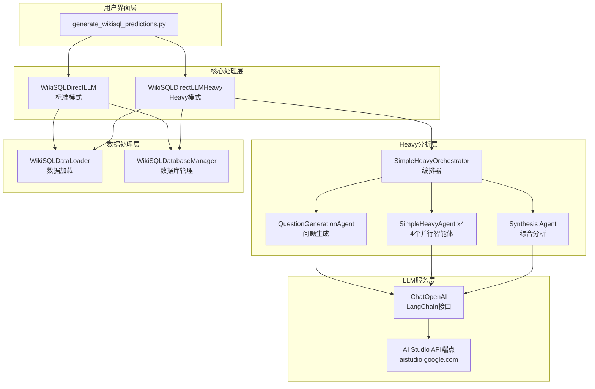
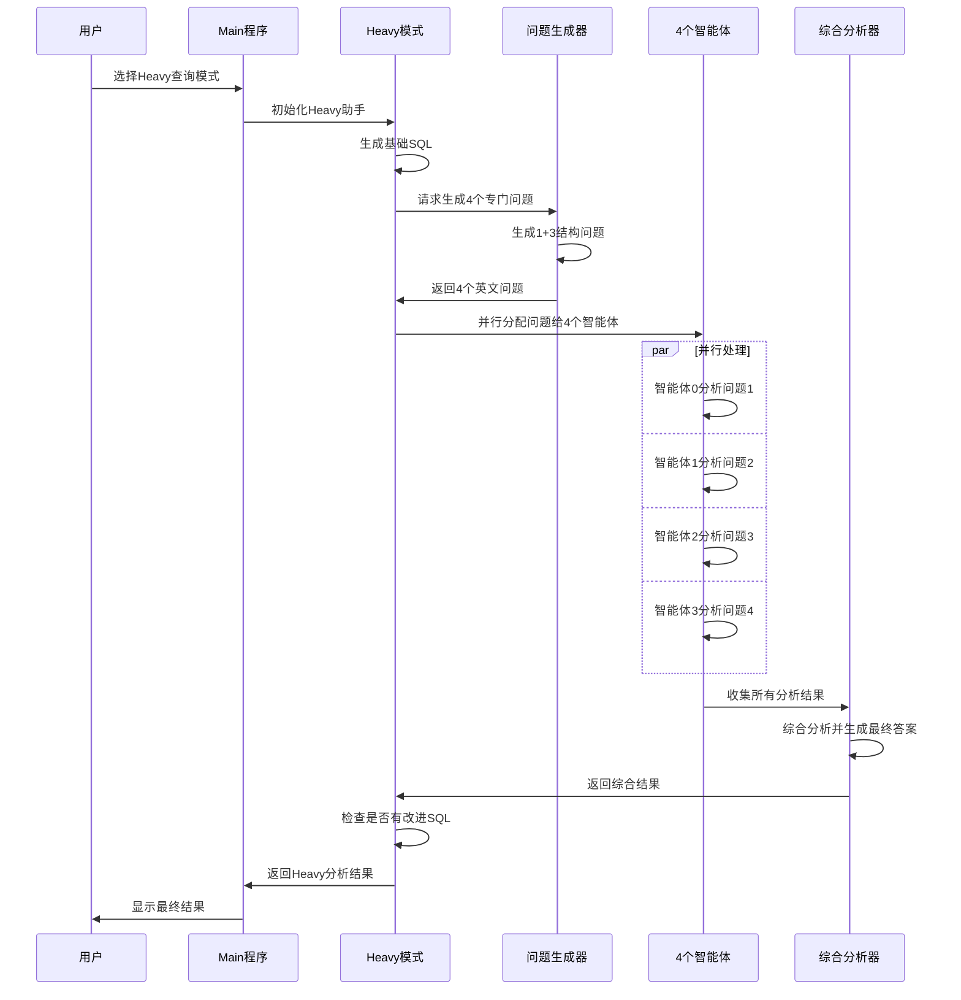

# WikiSQL Heavy System Architecture Flow

## 🏗️ 系统整体架构



## 🔄 Heavy模式详细流程



## 🧠 4个并行智能体详细分工



## 📊 问题生成结构 (1+3)



## 🔧 技术架构层次



## 🎯 数据流向



## 📁 文件结构

```
WikiSQL Heavy System/
├── generate_wikisql_predictions.py     # 主程序入口
├── wikisql_llm_direct.py              # 标准LLM查询
├── wikisql_heavy_integration.py       # Heavy集成（原始版本）
├── wikisql_heavy_simple.py            # 简化版Heavy实现 ⭐
├── wikisql_data_loader.py             # 数据加载器
├── wikisql_database_manager.py        # 数据库管理
├── wikisql_validator.py               # 结果验证
└── make-it-heavy/                     # Make It Heavy框架
    ├── agent.py                       # 基础智能体
    ├── orchestrator.py                # 编排器
    └── config.yaml                    # 配置文件
```

## 🚀 系统特点

### ✅ 优势
- **4个并行智能体**: 从不同角度深度分析
- **1+3问题结构**: 保持原始问题 + 3个变换角度
- **纯自然语言**: 不包含SQL语法的问题
- **全英文输出**: 统一的语言标准
- **综合分析**: Synthesis Agent整合所有结果

### 🎯 工作流程
1. **问题生成**: 1个原始 + 3个变换问题
2. **并行分析**: 4个智能体同时处理
3. **综合评估**: 整合所有分析结果
4. **SQL改进**: 如果需要，提供改进的SQL
5. **最终答案**: 返回完整的分析结果

这就是你当前的WikiSQL Heavy系统架构！🎉